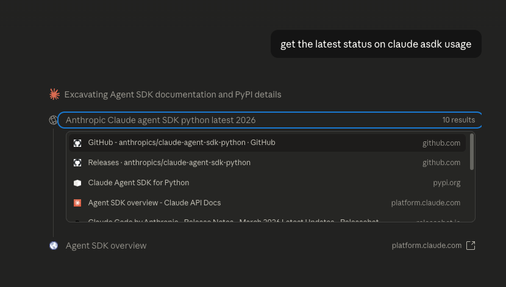
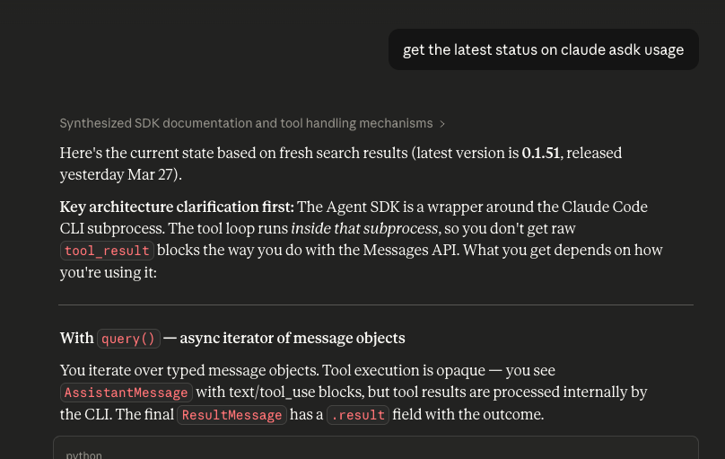
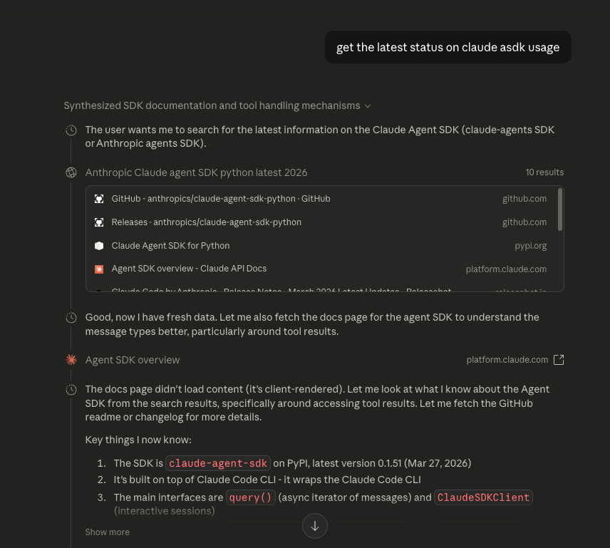

Building a UI that allows you to stream output is an interesting problem with the Agent SDK.
One of the main challenges, is that you don't know which of the messages it streams out is the 
final one, until the loop actually finishes.

# The challenges of streaming agentic outputs

## You dont know the final block until its out

So in your UI, if you want to treat intermediate messages differently, you only know they are 
intermediate once the next block comes out. If the next block is not a `Result Message` (the 
final block to come out of an agent turn), only then do you know the previous one was an intermediate
message.

## There are multiple return types

Also, streaming Agentic outputs is different from the problem of streaming out "simple" Assistant
responses. With an Assistant, there is just one response message, so you stream that.

With Agents, they have intermediate messages, thinking blocks, tool uses, and tool results. And 
these can return in any number and sequence.

## Streaming is more complicated anyway

Just streaming itself adds a lot more complexity.
1. How do you pass the stream data from the backend to the frontend? Different solutions and
options are available here, but all more complicated then just displaying data from a webhook
response. You can SSE (server sent events), or websockets to poll the data to the frontend. On
the backend you need to send the data somewhere it can be polled, for example a queue on Redis.
There are a lot of options around this in general, but piping data live from one place to another,
potentially over multiple services also, definitely adds complexity.
2. If a user refreshes the page mid message, how to display the current message to date, and continue
the stream if it is still live?

The concept of a turn is important also. A turn is all the things that happen from when your
message first hits the agent, until it returns its final response. A turn can include tool calls,
tool results, intermediate messages, and thinking blocks.

At an application level, you want to be able to track all these events as part of a single turn.
That's useful for creating a useful UI, and allowing you to know a message turn is complete.

A turn is what tells you the whether the response is complete or not. When a user loads a conversation
page, you check the status of the current turn. Is it still in progress? If so, continue streaming the
outputs. If not, we are ready to accept more user messages.

Notice have the Claude UI is structured as well. The concept of turn there is obvious also. It
includes
1. The original user message
2. The intermediate thinking blocks and tool calls
3. The final response message

Let's go through a message flow from Claude to show what it looks
like.

You kick off a user message, and Claude immediately opens up this intermediate sort of status block that
shows you all the things it is doing. This is the "intermediate" part with all the tool calls, results,
thinking blocks, and messages. Of course the UI here is selective in what it displays also. For example,
thinking blocks are often very verbose and not something we likely want to show the user.

Now the "turn" is complete. We see our final message response from the Assistant. And all the intermediate
parts have been collapsed.

The Claude UI allows us to expand the intermediate steps to see exactly what has happened. That can be very
useful to help us understand how our Assistant arrived at its final response. It can include links to
references from websites, and links use to intermediate data that was used to help build its response.
This could be especially great for data driven responses. Imagine our response was based on queries to the
database. Here we could build a link to that specific dataset, for example, to allow the users to inspect it
themselves.

The really interesting part is how this UI basically maps 1-1 with how the agentic loop works. And once you
know the internals of that, the link between the UI and internals are glaringly obvious.

# Sending stream events as event webhooks

The way my application is built is that the Claude Agent SDK is running on standalone python service, and I 
need to get the streamed outputs and message blocks from that to my full stack frontend application.

To do that I introduced the idea of sending the information over as webhook events. I thought it was nice idea, so I'll
share a little more of the setup. The core idea is that my backend assistant service does not need to know anything
about my frontend, and how it wants to use the data. It just publishes events as they come out. My frontend picks them up, and chooses what to do with
them. That decoupling is nice, and helps from starting to leak details and knowledge from my main application into the service.

I got the idea from using similar APIs myself, such as replicate and stripe. Those operate on a webhook style setup as
well.

The main events am sending over via the webhook are: Streams, Text Blocks, Tool Uses and the final Result Message.

My frontend application is a Rails app, using React on the frontend. Inside rails, I setup a websocket channel to 
publish the streams to, and the browser frontend listens for events over that channel. I setup the websocket 
channel using Rail's ActionCable class, which basically game me a zero config websocket setup. Super high level and
just works out of the box.

At the database level, you want all messages and tool events you save to be linked via a turn ID. You want to be able 
to link all events associated to a single turn. That gives a number of benefits, including the ability to be able to
build up UI's similar to the ones above from Claude

## The intermediate Text Block quirk
One of the quirks of streams and agents, is that you never know which is you final TextBlock until the loop is over.
The Claude Agent SDK generates TextBlocks for both intermediate and final messages. So if, for example, you only
want to stream the final Text Block, you never know if it's the final one until its complete, at which point
there is no point streaming anymore because you have the whole message.

The way I currently solved that is to also stream intermediate TextBlock messages to the UI, and then once I know it
is an intermedate one (i.e it is followed by a ToolUse, ThinkingBlock or any other block that is not the final 
ResultMessage), I can tweak its UI, for example make its colour more subtle, or event collapse it if it is a multiline
message, similar to how it looks in the Claude UI.

I noticed in Claude, their intermediate messages are never streamed. Not sure how they know to do that. It might be
that there is a top level Agent whose results are always streamed, and then all the actual work is done by a sub agent,
that only provides a final response to the top agent. That gives you the separation to always know which is the
final message, i.e the one returned by the top level agent.

In my current setup, the Agent SDK is my top level agent. So I don't think there is a way to distinguish between
intermediate and final blocks as they are being streamed. At least I can't think of any till now.

